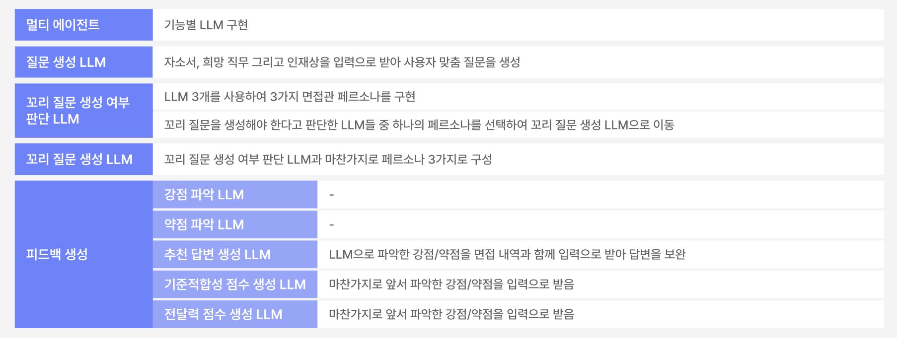
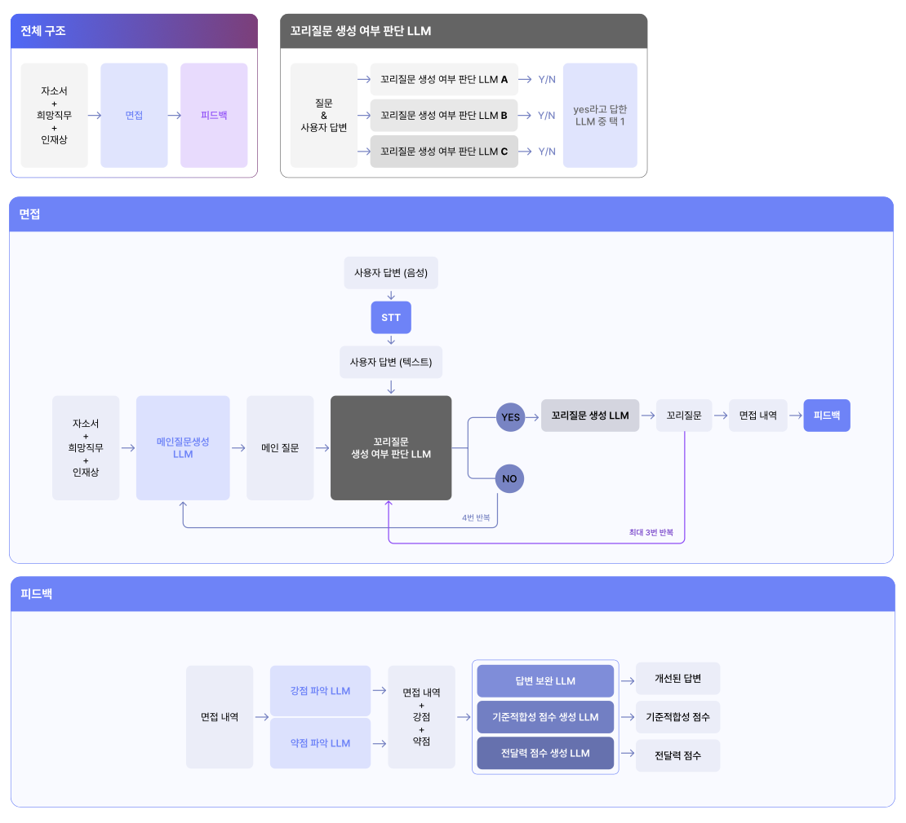

# Prepping

## About this project

Prepping(프레핑)은 AI(STT + LLM)을 활용한 면접 시뮬레이션 서비스입니다. “준비하다”의 “prep”과 point, reason, example, point의 면접 말하기기법인 “PREP”의 두가지 뜻을 담아 Prepping이라는 이름을 지었습니다. 

사용자의 면접 역량 향상을 위해, 바로 사용할 수 있을만큼 쉽게 실질적인 도움이 되는 면접 연습 환경을 제공합니다. 뿐만아니라 AI로 사용자 맞춤형 질문과 피드백을 생성해 더욱 개인화된 면접 준비 서비스를 제공합니다.  

 
## Demo Video

[Link] - [https://drive.google.com/file/d/1YhU0-9obomaSCXBEMVpMCPS8zft5IgrH/view?usp=sharing](https://drive.google.com/file/d/1YhU0-9obomaSCXBEMVpMCPS8zft5IgrH/view?usp=sharing)
 
## Tech Stack & Key Feature

 
## How we use LLM

 
## AI Architecture

 
## Team Member

최어진 - Lead / Design

김종협 - Develop/Fullstack

이준희 - Develop/Fullstack

전호석 - Develop/FE

이준형 - Develop/BE

## 로컬 서버 실행 방법
### 0. .env 파일 작성 (루트 디렉토리에)
UPSTAGE_API_KEY = up_mqjOAaRxVXodzWJiSRJa67j3AGnfK
OPENAI_API_KEY = sk-YiUsaKRljbVEaNIzzYgipOlE5p2xJnfyWXl7LVrQ8BT3BlbkFJcE0Cah30wqDuITIAqdWNefLcPKFlsiQS2bI9y4exMA

### 1. 프론트엔드 서버 실행법
터미널 -> cd frontend -> npm install next -> npm run dev

### 2. 백엔드 서버 실행법
터미널 -> cd backend -> python -m venv venv -> venv\Scripts\activate -> pip install -r requirements.txt -> python app.py

### 3. 서비스 실행
http://localhost:3000 실행 / <로그인> email: upstage@korea.ac.kr  password: upstage  /  면접 시작 버튼 누르기
